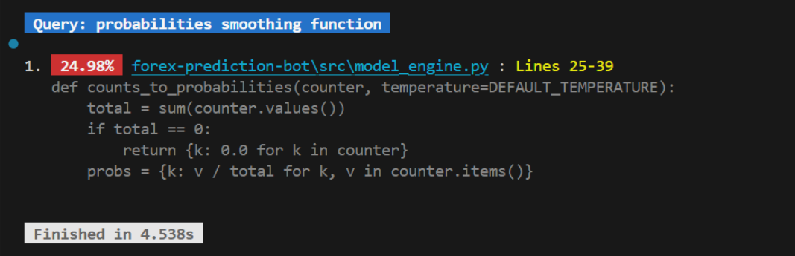
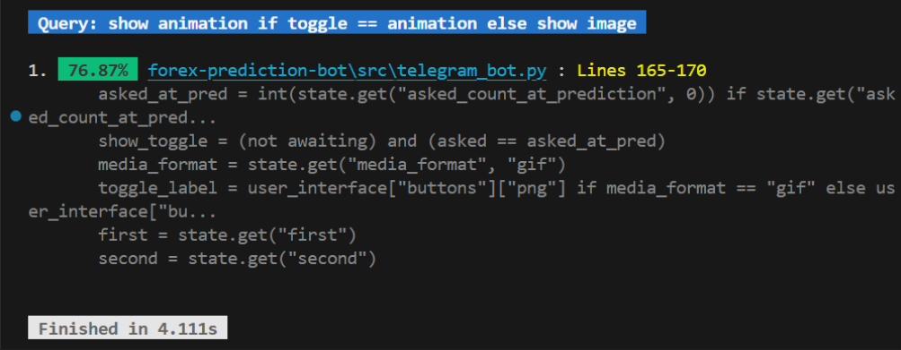

# Semantica

**Semantica** is a local, semantic search engine for your terminal.

Unlike `grep` or `ripgrep`, which rely on substring matching or regular expressions, Semantica uses vector embeddings to search by **concept**. It allows you to find code or documents based on their logic or meaning, even if the exact keywords do not exist in the file.


---

## Use Cases

Semantica is not a replacement for `grep`. It is designed for discovery and navigation in specific scenarios where keyword search fails.

### 1. Logic Search in Large Codebases
When working with legacy code or large monoliths, you often know *what* a function does, but not *how* it was named.
*   **Scenario:** You need to find where probability smoothing happens in a forecasting bot.
*   **Query:** `"probabilities smoothing function"`
*   **Result:** Finds `def counts_to_probabilities(...)` because the vector representation of the code (which recalculated probabilities using the temperature parameter) matches the concept of smoothing.




### 2. Pseudocode Search
You can describe the structure of the code you expect to find using pseudocode.
*   **Scenario:** You remember a specific UI toggle logic involving a media state.
*   **Query:** `-q "show animation if toggle == animation else show image"`
*   **Result:** Finds the exact conditional logic block in the source code.



### 3. Document Retrieval
It is also really useful for finding PDFs, DOCX and txt files with non-descriptive filenames (e.g., `scan_004.pdf`) based on their actual content.

---

## Technical Comparison

| Feature | Grep / Ripgrep | Semantica |
| :--- | :--- | :--- |
| **Method** | Exact Substring / Regex | Vector Cosine Similarity |
| **Indexing** | None (Real-time) | Required (Cached locally via FAISS) |
| **Speed** | Instant | Slower (requires model inference) |
| **Hardware usage** | Minimal | High |
| **Best for** | Known error codes, variable names, patterns. | Logic discovery, vague queries |

**Performance Note:** Semantica runs 100% locally. The first time you run it on a directory, it must scan, chunk, and embed the files. On large repositories, this will take time. Subsequent searches use the cached index and take seconds.

---

## Installation

### Option 1: Binary
Download the executable for your OS from the **[Releases](https://github.com/maxy618/semantica/releases)** page.
*   **Windows:** `semantica.exe`
*   **Linux:** `semantica`

### Option 2: Install from Source

**1. Clone the repository:**
```bash
git clone https://github.com/maxy618/semantica.git
cd semantica
```

**2. Create a virtual environment:**
```bash
# Windows
python -m venv .venv
.venv\Scripts\activate

# Linux / macOS
python3 -m venv .venv
source .venv/bin/activate
```

**3. Install the package:**
```bash
pip install .

# or for development:
# pip install -e .
```

**4. CRUCIAL: Download the Language Model:**
The text splitter requires a spaCy model for multilingual sentence boundary detection. The tool will not function without it.
```bash
python -m spacy download xx_sent_ud_sm
```

---

## Usage

### Basic Search
The default model (`bge-small`) provides a really good balance of speed and accuracy, but you can select any other model from the list below.
```bash
semantica -p ./my-repo -q "how is database connection handled"
```

### Search with Reranking (recommended)
For high-precision requirements, enable the reranker. This retrieves more candidates (default `k * 5`) and sorts them using a cross-encoder model. This takes some time, but it is 100% worth it for complex queries.
```bash
# Search top 3 results, reranking the top 15 candidates using Jina V2
semantica -p . -q "user login session logic" -k 3 --rerank
```

### Filtering and Depth
You can limit the scope of the search to specific directory depths or ignore certain file extensions.
```bash
# Only search the top-level files, ignoring CSVs
semantica -p . -q "summary report" -d 1 -i csv
```

### Cache Management
Embeddings are cached in `~/.cache/Semantica` (or `%LOCALAPPDATA%` on Windows).
```bash
# Delete indexes of the current path (useful if code changed significantly)
semantica -p . -q "test" --purge

# Delete a specific model to free disk space
semantica --purge-model minilm
```

---

## Configuration

| Argument | Description |
| :--- | :--- |
| `-p`, `--path` | Target directory or file to search. |
| `-q`, `--query` | The natural language search query. |
| `-k` | Number of results to display (Default: 3). |
| `-M` | Embedding model key (see below). Default: `bge-s`. |
| `--rerank` | Enable second-pass reranking (slower, more accurate). |
| `-rM` | Reranker model key (see below). Default: `jina-v2`. |
| `-f` | Rerank factor. Retrieves `k * f` candidates for reranking. Default: 5. |
| `-C` | Chunk size in characters. Default: 500. |
| `-o` | Chunk overlap ratio (0.0 - 1.0). Default: 0.5. |
| `-i` | Comma-separated list of extensions to ignore (e.g., `csv,txt`). |
| `-d` | Max directory recursion depth. |
| `--purge` | Purge the vector index for the current path/settings. |
| `-pm` | Delete specific model files from disk (e.g., `-pm code`). |
| `--nocache` | Run in memory only (do not save/load index from disk). |

### Supported Embedding Models (`-M`)

Models are downloaded automatically on first use.

| Key | Model Name | Size | Notes |
| :--- | :--- | :--- | :--- |
| **`bge-s`** | `bge-small-en-v1.5` | ~130MB | **Default.** Efficient and accurate |
| **`bge-m`** | `bge-base-en-v1.5` | ~400MB | Better for complex sentence structures |
| **`bge-l`** | `bge-large-en-v1.5` | ~1.3GB | Very accurate, but requires more RAM and takes a lot of time |
| **`minilm`**| `all-MiniLM-L6-v2` | ~80MB | Very fast but way less accurate than the default one |
| **`code`** | `jina-embeddings-v2-code` | ~500MB | Trained specifically on code and API docs |
| **`multi`** | `multilingual-e5-large` | ~2GB | Heavy. Best for non-English languages |
| **`nomic`** | `nomic-embed-text-v1.5` | ~500MB | Long context window support. One of the best accuracies btw |

### Supported Reranker Models (`-rM`)

Rerankers are used only if `--rerank` is enabled.

| Key | Model Name | Notes |
| :--- | :--- | :--- |
| **`jina-v2`** | `jina-reranker-v2-base-multilingual` | **Default.** good balance of speed and accuracy |
| **`bge-r-b`** | `bge-reranker-base` | Worked really bad in some scenarios |
| **`bge-r-l`** | `bge-reranker-large` | More accurate, but i still won't reccomend to use it tbh |

---

## Building from Source

To build a standalone executable that includes all dependencies and has good performance, you **must** use **Nuitka** with the specific flags below.

### Windows (PowerShell)
```powershell
$env:PYTHONPATH='src'; python -m nuitka --standalone --onefile --mingw64 `
    --include-package=semantica `
    --include-package=fastembed `
    --include-package=faiss `
    --include-package=pypdf `
    --include-package=docx `
    --include-package=termcolor `
    --include-package=xx_sent_ud_sm `
    --include-package-data=xx_sent_ud_sm `
    --spacy-language-model=xx_sent_ud_sm `
    --include-package=tokenizers `
    --include-package=onnxruntime `
    --nofollow-import-to=matplotlib `
    --nofollow-import-to=pandas `
    --nofollow-import-to=scipy `
    --nofollow-import-to=IPython `
    --nofollow-import-to=pytest `
    --nofollow-import-to=tkinter `
    --output-filename=semantica.exe `
    entry.py
```

### Linux
```bash
PYTHONPATH=src python3 -m nuitka \
  --standalone \
  --onefile \
  --include-package=semantica \
  --include-package=fastembed \
  --include-package=faiss \
  --include-package=pypdf \
  --include-package=docx \
  --include-package=termcolor \
  --include-package=xx_sent_ud_sm \
  --include-package-data=xx_sent_ud_sm \
  --spacy-language-model=xx_sent_ud_sm \
  --include-package=tokenizers \
  --include-package=onnxruntime \
  --nofollow-import-to=matplotlib \
  --nofollow-import-to=pandas \
  --nofollow-import-to=scipy \
  --nofollow-import-to=IPython \
  --nofollow-import-to=pytest \
  --nofollow-import-to=tkinter \
  --output-filename=semantica_linux \
  entry.py
```

---

## License

MIT